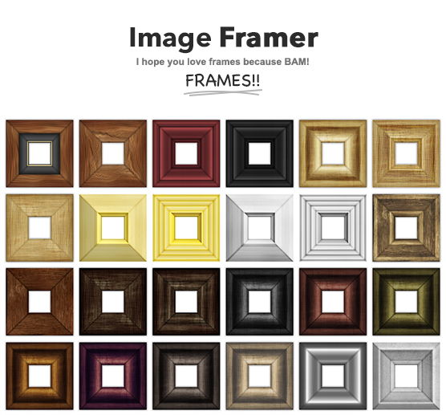

## Image Framer jquery plugin

Image Framer is very simple jQuery plugin that wraps your images inside a frame. _Actually, despite the name, you can frame any element._


_Website is coming soon._ Currently you can find demo html files in the package.

## Freatures

* All of the frames are flexible to pretty much any image size
* Contains 24 frames
* All frames come in 4 different sizes
* 4 different optional inner shadows
* HTML 5 data-attributes can be used to overwrite the plugin options

## Usage instructions

###1.

Add imageframer folder to you website root, add the following to your web page `<head>`.

```javascript
<script type="text/javascript" src="jquery.min.js"></script>
<link rel="stylesheet" type="text/css" href="imageframer/if.css" />
<script type="text/javascript" src="imageframer/if.js" ></script>
<script type="text/javascript">
    $(function() {

      $('.frame').imageframer();

    });
</script>
```

###2.

Add the `.frame` class to all elements you wish to frame


## Tested browsers

* _Coming soon..._

## What's to come (maybe)?

* Moar frames!!!
* a psd file and script, to enable anyone ( who has photoshop ) to make frames in a snap.
 * Currently I do have a file much like that, to streamline my workflow to create the frames, but it's much too messy to be released to the wild ...and I use it with Slicy.
* I do also have a script that enables you to very easily re-color frames with very little effort. I just need to clean that up as well.
* I need to refine some of the frame files.
 * Quality
 * top-bottom and right-left images are unnecessary wide for some frame types.
 * I pretty much half-assed the way I named the frames. Need to work on that.
